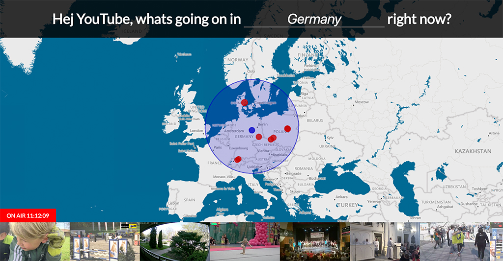

# Hej Youtube, whats going on in the world?

This is a 22h hackathon project created at [ValHacks 2018](http://best.dtu.dk/hackathon/).
Browse the world and see all the livevideos that are broadcasted nearby the location on YouTube.

[Start the App](https://live.cloud-player.io)

## Main repository
This project is borrowing code from our main project [Cloud-Player](https://github.com/cloud-player/web) to realize the YouTube playback part.
[Check out our free music player that can play YouTube and SoundCloud tracks](https://cloud-player.io)

## Technologies
[Microsoft Bing Maps V8 Control](https://www.microsoft.com/en-us/maps/v8-control) is used to let the user choose a location on the map. The [Microsoft Locations Api](https://msdn.microsoft.com/en-us/library/ff701715.aspx) 
is used to resolve the location into a Country name to display it in the header.

The selected location is send to the [Youtube Data Api](https://developers.google.com/youtube/v3/docs/) to get live videos that are currently broadcasted within a radius
of 1000km.

[timezonedb API](https://timezonedb.com/api) is used to get the current timezone of the selected location to show the current time in that country.

The application is build with [TypeScript](https://www.typescriptlang.org/) and [Angular5](https://angular.io/)

## Run it locally
- Clone Repository
- Set API keys
  - Open the file [api-keys.ts](./src/api-keys.ts)
  - Setup the API Keys. You can get the API keys for free.
    - Create a YouTube API key [here](https://console.developers.google.com/)
    - Create a Bing API key [here](https://www.bingmapsportal.com/)
    - Create a TimezoneDB API key [here](https://timezonedb.com/register)
- Run npm install
- Run npm start
